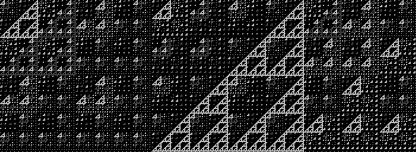
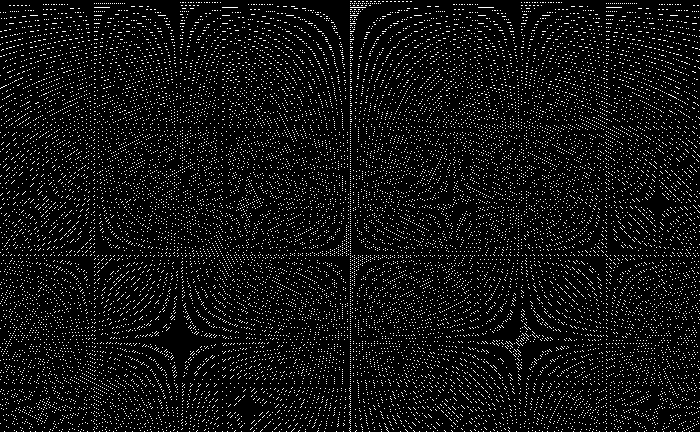
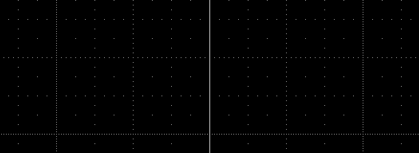
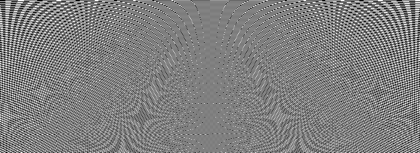

## bitshift

 
`(x|y)%K, X 0, Y 0, K 7`

bitmap images formed by taking the Boolean (zero/non-zero) value for each pixel from chains of arithmetic and bitwise logical operations on pixel *x y* coordinates, and a constant *K*. Zero coded white by default.

---

## Usage

Set parameters by altering #define constants and macros at the head of bitshift.c.

|          |  |
|:---------|:-|
|`N`       |`number of frames`|
|`X_STRIDE`|`common difference (-inf,inf) for all X in frame sequence`|
|`Y_STRIDE`|`common difference for all Y`|
|`K_STRIDE`|`common difference for all K`|

To generate an *N*-length image sequence in DIR:

`$ cc bitshift.c && ./a.out <DIR/BASENAME>`

Frames are written in raw .pbm format. Filename format is BASENAME_INDEX_X_Y_K.pbm, where X and Y are the coordinates of the upper left corner, the lowest x, y values of the image. Individual frames should normally be converted to losslessly compressed .png format for further use:

`$ convert <fname>.pbm <fname>.png`

Image sequences can be compiled into video using ffmpeg with the following command pattern:

`$ ffmpeg -framerate 10 -pattern_type glob -i '*.pbm' -b:v 25M video.mp4`

As follows into animated gif:

`$ ffmpeg -framerate 10 -pattern_type glob -i '*.pbm' anima.gif`

---

## Examples

- OR_DIV
`((x | y) % K)` 
remainder of Euclidian division by *K* of bitwise OR on the binary expressions of *x y*. Forms complex systems of Sierpiński triangles.

 
`(x|y)%K, X 0, Y 0, K 0,1,...,159`

 

- MUL_AND `((x * y) & K)` 
bitwise AND on the binary expressions of the product *xy*, and *K*. Repeated attempts to establish non-linear structure break down. Complex patterns appear suddenly and decay chaotically. A highlight event is the transition from *K*=1023 to *K*=1024.

 
`(x*y)&K, X 162, Y 1, K 900,901,...,1155`

 
`(x*y)&K, X 674, Y 32, K 1023`

 
`(x*y)&K, X 674, Y 32, K 1024`

